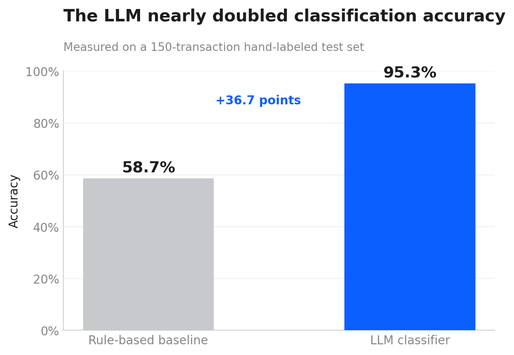
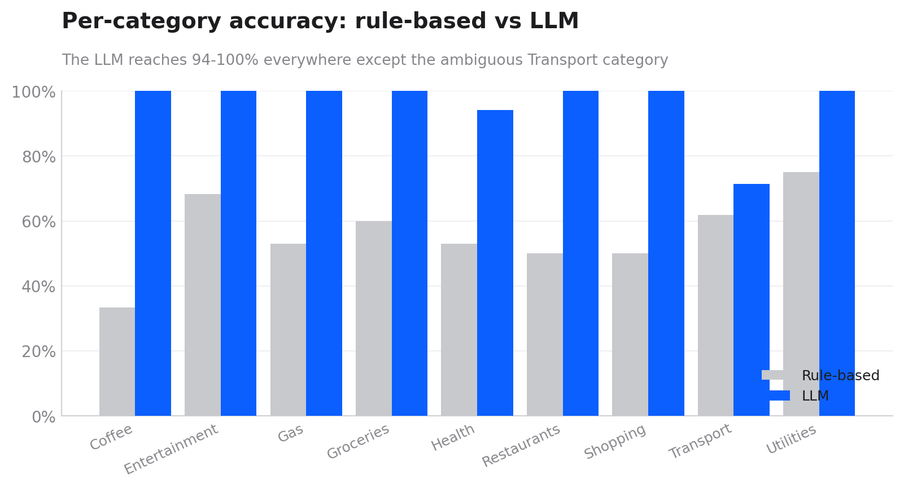
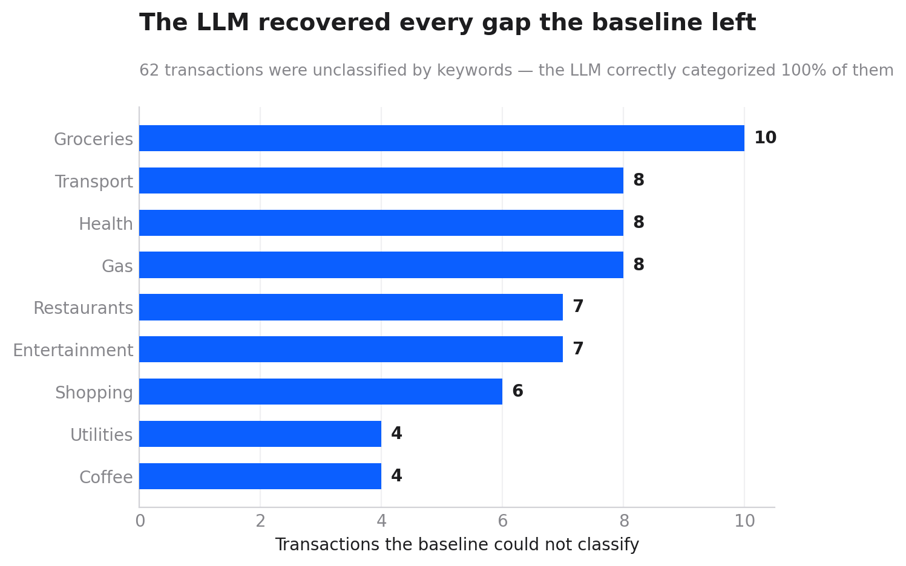

# AI-Powered Transaction Classifier

Classifies messy bank transaction descriptions into spend categories using a Large Language Model, and measures whether the AI approach actually beats a traditional rule-based baseline.

## Summary of Results

A keyword-based baseline classified transactions with 58.7 percent accuracy on a 150-transaction hand-labeled test set. An LLM classifier reached 95.3 percent, a lift of 36.7 percentage points. The baseline left 41 percent of transactions unclassified because they did not match any keyword. The LLM correctly recovered every one of those transactions from context.



## Business Problem

Banks, budgeting apps, and finance teams need to turn raw transaction descriptions (for example, `SQ *BLUE BOTTLE 9722 DALLAS TX`) into clean spend categories. Rule-based keyword systems handle the obvious cases but break on messy or unfamiliar descriptions. Clean categorization is the foundation for budgeting tools, spend analytics, and fraud detection.

## Target Stakeholder

Product or data teams at a fintech or budgeting app, or a finance operations team categorizing card spend.

## Approach

The project deliberately builds and compares two methods.

1. Rule-based classifier: keyword matching, the traditional baseline.
2. LLM classifier: the Claude API, processing transactions in batches for speed and lower cost.
3. Evaluation framework: a hand-labeled test set that measures the accuracy of both methods.

The goal is not just to use AI. The goal is to measure whether it is actually the better choice.

## How the Two Methods Compare by Category



The LLM reaches 94 to 100 percent accuracy in every category except Transport. The Transport result is explained in the Limitations section below.

## The Baseline's Core Weakness



The rule-based classifier did not usually assign the wrong category. Instead, it failed to classify 41 percent of transactions at all, because they contained no recognized keyword. The LLM correctly categorized every transaction the baseline left unclassified.

## Tools Used

- Python (pandas) for data handling and the pipeline
- Anthropic Claude API for LLM classification
- DuckDB for SQL analysis of results
- matplotlib for charts
- Jupyter Notebook for exploration
- GitHub for version control

## Dataset

Synthetic dataset of 2,000 transactions, generated to simulate realistic merchant description messiness. This includes payment processor prefixes (TST*, SQ*, POS DEBIT), inconsistent casing, store numbers, and formatting noise. This is not real customer data. It is generated via `src/generate_transactions.py` and is reproducible because it uses a fixed random seed.

Columns: `transaction_id`, `date`, `description`, `amount`, `true_category`.

## Evaluation Method

A 150-transaction random sample was hand-labeled by reading each description. Where the hand label disagreed with the generator label, the row went through an adjudication pass to set a final ground-truth label. Both classifiers were then measured against this locked test set (`eval/test_set_final.csv`).

## Key Engineering Choices

- Batching: the LLM classifier sends 20 transactions per API call rather than one per call, which reduces both runtime and cost.
- Baseline first: the rule-based classifier was built before the LLM, so the AI result could be measured against a real benchmark.
- Independent ground truth: the test set was hand-labeled, not taken from the generator, so the accuracy numbers are not circular.

## Limitations

- The dataset is synthetic. The 95.3 percent LLM accuracy reflects performance on clean synthetic merchant strings and would likely be lower on real bank data.
- Of the LLM's 7 misclassifications, 6 were a single ambiguous merchant, Uber Eats, which can reasonably be classified as either Transport or Restaurants. The LLM chose Restaurants while the ground truth was set to Transport. This single ambiguity explains the lower Transport accuracy.
- The 150-transaction test sample contains only 6 Coffee transactions due to random sampling variation, so Coffee accuracy is based on a small number of cases.
- All metrics are project-level and dataset-level. They do not represent real-world company performance.

## Repository Structure

```text
transaction-classifier-ai/
  data/
    raw/          synthetic dataset
    processed/    classifier prediction outputs
  notebooks/      data exploration
  src/            pipeline scripts
  eval/           test set and evaluation results
  charts/         result charts
  docs/           data dictionary and assumptions
  README.md
```

## What This Project Demonstrates

- Integrating an LLM into a real data pipeline
- Building an evaluation framework rather than assuming the AI worked
- Cost-aware engineering through batched API calls
- SQL analysis, data labeling, and honest reporting of limitations