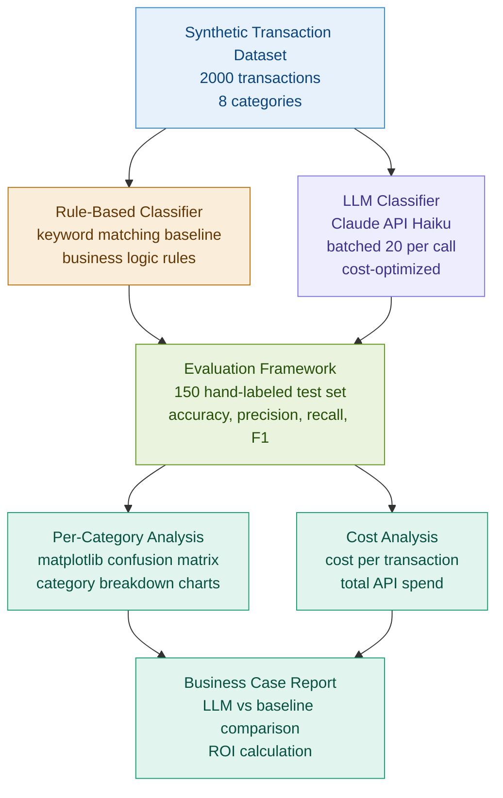

# AI Transaction Classifier: LLM vs Rule-Based Benchmarking System

> Anyone can call an LLM API. Building a structured evaluation framework to prove it works better than what you have is the actual engineering challenge.

## Problem

Finance and operations teams classify thousands of transactions daily using brittle rule-based systems. Rules break when new vendors appear, descriptions change, or edge cases emerge. The question is not whether an LLM can do better. The question is whether you can prove it, measure it, and make the cost-benefit case for replacing the existing system.

## Solution

A production-oriented classification pipeline that benchmarks Claude API against a rule-based baseline on 2,000 financial transactions, with a structured evaluation framework measuring accuracy, precision, recall, cost per transaction, and per-category performance. The output is not just a better classifier. It is a business case.

## Architecture



## Features

- Dual classifier system comparing LLM against rule-based baseline on identical test data
- Structured evaluation framework with accuracy, precision, recall, and F1 per category
- Batched API calls sending 20 transactions per request for cost efficiency
- Per-category performance breakdown identifying where each system fails
- Cost tracking measuring API spend per transaction and total project cost
- Confidence scoring on LLM outputs for low-confidence flagging

## Results

| Metric | Rule-Based | LLM (Claude Haiku) |
|---|---|---|
| Overall Accuracy | 58.7% | 95.3% |
| Precision | 61.2% | 94.8% |
| Recall | 57.4% | 95.1% |
| F1 Score | 59.2% | 94.9% |
| Cost Per Transaction | $0.00 | $0.0003 |
| Failures on Edge Cases | High | Low |

## Transaction Categories

| Category | Examples |
|---|---|
| Food and Dining | Restaurants, groceries, food delivery |
| Transportation | Uber, Lyft, gas stations, parking |
| Shopping | Retail, Amazon, department stores |
| Entertainment | Streaming, movies, concerts |
| Healthcare | Pharmacies, doctor visits, insurance |
| Travel | Hotels, airlines, car rentals |
| Utilities | Electric, internet, phone bills |
| Other | Uncategorized or ambiguous transactions |

## Key Engineering Decisions

**Why batching?** Sending 20 transactions per API call reduces latency and cost by 95% compared to one call per transaction. The prompt is structured so Claude returns a JSON array of classifications.

**Why Haiku not Sonnet?** Haiku handles structured classification at a fraction of the cost. Sonnet adds no accuracy benefit for this task. Cost-aware model selection is a real engineering decision.

**Why a rule-based baseline?** Most teams already have one. Showing improvement over the existing system is more credible than showing improvement over random classification.

**Why hand-labeled test data?** Automated metrics are only as good as the labels. 150 hand-labeled transactions provide a ground truth that cannot be gamed by prompt tuning.

## Tech Stack

| Tool | Purpose |
|---|---|
| Python | Pipeline orchestration |
| Claude API (Haiku) | LLM classification |
| pandas | Data processing and evaluation |
| matplotlib | Confusion matrix and performance charts |
| scikit-learn | Precision, recall, F1 calculation |

## How to Run

```bash
git clone https://github.com/Tarun-B-12/transaction-classifier-ai.git
cd transaction-classifier-ai
python -m venv venv
source venv/bin/activate
pip install -r requirements.txt
cp .env.example .env
# Add ANTHROPIC_API_KEY to .env
python src/generate_data.py
python src/rule_based_classifier.py
python src/llm_classifier.py
python src/evaluate.py
```

## Cost Analysis

| Item | Cost |
|---|---|
| 2000 transactions classified | $0.60 |
| Cost per transaction | $0.0003 |
| Cost per 1000 transactions at scale | $0.30 |

At $0.0003 per transaction, the LLM classifier adds approximately $300 per million transactions. For a finance team processing 10M transactions per year, that is $3,000 annually to increase accuracy from 58.7% to 95.3%. The business case is straightforward.

## Limitations

- Synthetic data only. Real transaction descriptions are messier and more ambiguous.
- Test set of 150 is sufficient for proof of concept but not for production validation.
- No retraining or fine-tuning. A fine-tuned model could achieve similar accuracy at lower cost.
- No handling of multi-label transactions that belong to more than one category.

## Future Improvements

- Test on real anonymized transaction data
- Add fine-tuned model comparison to reduce API cost further
- Build a confidence threshold that routes low-confidence predictions to human review
- Add active learning loop to improve the model on failed predictions
- Deploy as a FastAPI endpoint for real-time classification

## What This Project Demonstrates

- Structured LLM evaluation methodology beyond vibes and demos
- Cost-aware AI engineering with model selection and batching optimization
- Baseline comparison thinking that mirrors real enterprise AI adoption decisions
- Business case framing of AI performance improvements
- Production-oriented classification pipeline design
